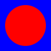

# Elise Graphics Library

## Introduction

Elise provides a [retained mode graphics API](https://docs.microsoft.com/en-us/windows/win32/learnwin32/retained-mode-versus-immediate-mode)
based on the [HTML5 canvas element](https://en.wikipedia.org/wiki/Canvas_element).

Graphics primitives include:
* **Line** - Stroked line segment
* **Rectangle** - Stroked and filled rectangle
* **Ellipse** - Stroked and filled ellipse
* **Polyline** - Stroked, multiple segment line
* **Polygon** - Stroked and filled multiple line segment shape
* **Path** - Stroked and filled shaped defined by line and curve segments
* **Image** - Bitmap image
* **Text** - Stroked and filled text
* **Sprite** - Bitmap image segment
* **Model** - Collection of composed elements

## Installation

Elise is provided as a CommonJS structured JavScript library with TypeScript type definitions and as a packed UMD module
with a global name of 'elise'.

### Install using NPM

>
> `
> npm i elise-graphics
> `

## Browser Use (UMD)

The packed UMD module is located in the node_modules/elise-graphics/_bundles folder after installing using NPM.
To load the packed UMD module into the global namespace using the name 'elise', either the elise-graphics.js or
elise-graphics-min.js (minimized) must be loaded by the host web page.  An HTML div element is created and
provided to Elise for viewing rendered content.
```html
    <!DOCTYPE html>
    <body>
        <!-- Elise Host Element -->
        <div id="app"></div>

        <!-- JS Library Dependencies -->
        <script src="elise/_bundles/elise-graphics.js"></script>
    </body>

    </html>
```
The path to the script bundle is application specific. The snippet above assumes the 'elise/' path is mapped
to the node_modules/elise-graphics folder. For Express this can be done as follows:

```javascript
    // Allow front-end access to node_modules/elise-graphics folder
    app.use('/elise', express.static(`${__dirname}/node_modules/elise-graphics`));
```
Given a host div with an id of 'app' as shown in the HTML example above, an Elise model can be created,
populated with elements and bound to the designated element.
```javascript
    var hostDiv = document.getElementById('app');
    var model = elise.Model.create(100, 100).setFill('Blue');
    var rect = elise.EllipseElement.create(50, 50, 40, 40).setFill('Red');
    model.add(rect);
    elise.view(hostDiv, model);
```
The example above does the following:
* Creates a model with a width and height of 100 units.
* Sets the fill (background) color of the model to blue.
* Create an ellipse element with a center point of 50,50 and with horizontal and vertical radii of 40 units.
* Sets the fill color of the ellipse element to red.
* Adds the ellipse element to the model.
* Binds the model to the host div element to be rendered in the browser.

**Result**

 
