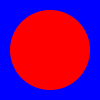

# Elise Graphics Library

## Introduction

Elise provides a [retained mode graphics API](https://docs.microsoft.com/en-us/windows/win32/learnwin32/retained-mode-versus-immediate-mode)
based on the [HTML5 canvas element](https://en.wikipedia.org/wiki/Canvas_element).

Elise provides a set of graphics primitives for representing 2D graphical content.  Elements are grouped into model objects that serve as
their container and provide a repository for additional resources required for their display. Some elements are stroked and must have a
stroke color and optionally width specified to be visible when rendered. Some elements are fillable and may be filled with solid colors,
color gradients, images, or other models.  Models may be added as elements to other models to allow composition of highly complex models
from simpler elements.

### Features

* Rich set of 2D drawing primitives including line, rectangle, ellipse, polyline, polygon, path, image, text, and sprites.
* Shared resource library for indirect referenced to bitmap, model, and text resources with support for localization.
* Support for element interactivity, property tweening, touch interaction, and animation.
* Support for sprite and image transitions.
* SVG import and export with hierarchy-preserving container support, `<symbol>`/`<use>` handling, and gradient/clip-path interop.
* Event bubbling through nested model hierarchies for composable interactive content.
* Design surface and component library for interactive model creation and editing, including inline rich-text editing with formatting shortcuts.
* Higher level surface library for creation of graphical applications with integration of video and other HTML content.
* Sketcher class to gradually draw and fill complex polygonal models for visual effect.

## Installation

Elise is provided as a CommonJS structured JavaScript library with TypeScript type definitions and as a packed UMD module
with a global name of **elise**.

### Install using NPM

>
> `
> npm i elise-graphics
> `

## CommonJS Use (e.g. Browserify, Webpack, RequireJS)

If utilizing one of the popular JavaScript packaging tools available that support CommonJS, the Elise can be imported with a
require statement after installation.

```javascript
    var elise = require('elise-graphics');
```

## Browser Use (UMD bundle)

Alternatively, one of the bundled UMB scripts can be included in an HTML script tag to import Elise into the global JavaScript
namespace using the name **elise**.  If the script is included immediately prior to the closing body tag, then the preceeding
DOM elements will be available for scripting.

The packed UMD modules are located in the node_modules/elise-graphics/_bundles folder after installing using NPM.

* **elise-graphics.js** - Expanded with code documentation
* **elise-graphics-min.js** - Minimized without documentation

The appropriate script may be copied to an application folder used for third part scripts or referenced directly
from its location in the node_modules folder.

If using Express, an alias to the node_modules folder can be created:

```javascript
    // Allow front-end access to node_modules/elise-graphics folder
    app.use('/elise', express.static(`${__dirname}/node_modules/elise-graphics`));
```

The snippet below assumes the 'elise/' path is mapped to the node_modules/elise-graphics folder using this method.

```html
    <!DOCTYPE html>
    <body>
        <!-- Elise Host Element -->
        <div id="elise-host"></div>

        <!-- JS Library Dependencies -->
        <script src="elise/_bundles/elise-graphics.js"></script>
    </body>

    </html>
```

## Simple Example

Given a host div with an id of 'elise-host' as shown in the HTML example above, an Elise model can be created,
populated with elements and bound to the designated element.

```javascript
    var hostDiv = document.getElementById('elise-host');
    var model = elise.Model.create(100, 100).setFill('Blue');
    var rect = elise.EllipseElement.create(50, 50, 40, 40).setFill('Red');
    model.add(rect);
    elise.view(hostDiv, model);
```

The example above does the following:

* Creates a model with a width and height of 100 units.
* Sets the fill (background) color of the model to blue.
* Create an ellipse element with a center point of 50,50 and with horizontal and vertical radii of 40 units.
* Sets the fill color of the ellipse element to red.
* Adds the ellipse element to the model.
* Binds the model to the host div element to be rendered in the browser.

## Result

&nbsp;&nbsp;&nbsp;&nbsp;&nbsp;&nbsp;

## Property Tween Animation

Elise includes a property tweening API for animating element bounds, centers, radii, endpoints, fill transforms, opacity, rotation, type size, fill color, and stroke color without writing a manual `requestAnimationFrame` loop.

```javascript
    var rect = elise.rectangle(40, 40, 120, 72)
        .setFill('#6f8fb8')
        .setStroke('#8caad0');

    model.add(rect);

    rect.animate({
        x: 96,
        y: 84,
        width: 180,
        opacity: 0.65,
        fill: '#d4875d'
    }, {
        duration: 900,
        easing: 'easeInOutCubic',
        onComplete: function () {
            rect.animate({
                x: 40,
                y: 40,
                width: 120,
                opacity: 1,
                fill: '#6f8fb8'
            }, {
                duration: 700,
                easing: 'easeInOutQuart'
            });
        }
    });
```

### Animation API

* `element.animate(targets, options)` starts a tween and returns an `ElementTween` instance.
* `element.cancelAnimations()` stops all active tweens for the element.
* `element.cancelAnimations(['x', 'opacity'])` stops only the listed properties.
* `AnimationEasing` exposes 31 built-in easing functions covering linear, quad/cubic/quart/quint, sine/expo/circ, and back/elastic/bounce families, plus the lookup helper.

Supported tween targets include:

* `x`, `y`, `width`, `height`
* `centerX`, `centerY`, `radiusX`, `radiusY`
* `x1`, `y1`, `x2`, `y2`
* `fillScale`, `fillOffsetX`, `fillOffsetY`
* `rotation`, `opacity`, `typesize`
* `fill`, `stroke`

When a new tween starts on a property that is already animating on the same element, Elise cancels the older tween for that property and keeps the newer one. This makes replay and interruption predictable for interactive scenes.

See `examples/animation-system-showcase.html` and `examples/animation-system-showcase.js` for a complete browser example.

## Touch Interaction

Elise now routes single-touch input through the same interaction path as mouse input in both `ViewController` and `DesignController`, so existing click, drag, selection, and tool workflows work on touch devices without separate event wiring.

For design surfaces, two-finger gestures are also supported:

* Pinch to zoom the design canvas.
* Two-finger pan the nearest scroll container around the design surface.

Touch listeners are registered with `touchAction = 'none'` so the canvas can capture gesture intent directly instead of competing with browser scrolling.

## SVG Import and Export

Elise supports importing SVG content into a model and exporting models back to SVG markup.

### SVG Import

```javascript
var model = elise.Model.create(400, 300);
elise.SVGImporter.import(svgString, model);
```

The importer handles `<path>`, `<rect>`, `<ellipse>`, `<circle>`, `<line>`, `<polygon>`, `<polyline>`, `<text>`, `<image>`, `<g>`, `<symbol>`, and `<use>` elements. Container elements (`<g>`, nested `<svg>`, `<symbol>`) are preserved as nested `ModelElement` hierarchies rather than flattened, and `<use>` references are resolved against named elements. Inherited styles, gradients, clip paths, and transforms are imported.

### SVG Export

```javascript
var svgMarkup = model.toSVG();
```

All major element types export to their SVG equivalents. Reusable model-resource-backed elements export as `<symbol>` + `<use>` pairs, and embedded source models export as nested `<g>` groups.

## Event Bubbling

Events propagate through the model hierarchy from the deepest nested element outward through `ModelElement` containers. The `ViewController` exposes `mouseOverPath` and `pressedPath` arrays that contain the ordered element ancestry from deepest child to outermost container. Mouse enter/leave, down/up, and click events are dispatched to every element in the path.

```javascript
controller.elementClicked.add(function(source, element) {
    // Fires for each element in the ancestry path, deepest first
    console.log('Clicked:', element.id);
});
```

## Rich Text Editing

The design surface supports inline text editing with rich formatting. Double-click or type into a selected text element to enter edit mode:

* Keyboard entry, backspace, delete, and enter for newline
* Arrow key caret navigation (left, right, up, down across visual lines)
* Shift+arrow for selection extension
* Home/End for line/text boundary navigation
* Double-click to select a word
* **Ctrl+B** for bold, **Ctrl+I** for italic, **Ctrl+U** for underline
* Escape to exit text edit mode

## Design Surface Clipboard API

The design surface now exposes programmatic clipboard helpers directly on `DesignController`, so toolbar and menu commands do not need to synthesize keyboard events.

```javascript
const editor = elise.design(hostDiv, model);

copyButton.onclick = () => editor.copySelectedToClipboard();
cutButton.onclick = () => editor.cutSelectedToClipboard();
pasteButton.onclick = () => void editor.pasteFromClipboard();

// Custom application clipboard store
const clipboardText = editor.exportSelectionClipboardText();
if (clipboardText) {
    appClipboard = clipboardText;
}

if (appClipboard) {
    editor.pasteClipboardData(appClipboard, 8, 8);
}
```

Available editor clipboard methods:

* `copySelectedToClipboard()` copies the current selection to the internal clipboard and, when available, `navigator.clipboard`.
* `cutSelectedToClipboard()` copies then removes the current selection.
* `pasteFromClipboard()` pastes from the system clipboard or Elise's internal clipboard buffer and applies the standard incremental paste offset.
* `exportSelectionClipboardData()` returns a structured clipboard payload for app-managed clipboard integrations.
* `exportSelectionClipboardText()` returns the serialized clipboard JSON string.
* `pasteClipboardData(data, offsetX?, offsetY?)` pastes a structured payload or serialized payload directly.

## Example Projects

* [Simple Example Project](https://github.com/thetheosopher/elise-simple-demo)
* [Browserify Example Project](https://github.com/thetheosopher/elise-browserify-demo)

## Core Elements and Concepts

Graphics primitives include:

* **Line** - Stroked line segment
* **Rectangle** - Stroked and filled rectangle
* **Ellipse** - Stroked and filled ellipse
* **Polyline** - Stroked, multiple segment line
* **Polygon** - Stroked and filled multiple line segment shape
* **Path** - Stroked and filled shaped defined by line and curve segments
* **Image** - Bitmap image
* **Text** - Stroked and filled text
* **Sprite** - Bitmap image segment
* **Model** - Collection of composed elements

### Strokes

Stroked elements require a stroke property to define the color and width of the stroke used to render them. Strokes may be defined using
either one of the named colors or a hex style color and may optionally specify a width other than the default of one drawing unit.

### Fills

Fillable elements may be filled with:

* **Solid Color** - Solid color with optional alpha transparency
* **Gradient** - Gradual color swath with arbitrary number of color stops
  * **Linear Gradient** - Linear gradient
  * **Radial Gradient** - Radial gradient
* **Image** - Tiled bitmap fill with configurable fill scale and opacity.
* **Model** - Tiled fill of external or embedded drawing model with configurable fill scale and opacity.

### Transforms

Elements may have affine transforms assigned to alter their visual representation

* **Translate** - Translate (reposition) element
* **Scale** - Scale (resize) element
* **Rotate** - Rotate element
* **Skew** - Skew element horizontally or vertically
* **Matrix** - Combination of transforms specified in matrix form

### Colors

Colors are specified with a text string using one of the following forms:

* **Named Color** - One of the known named colors (e.g. Red, Blue, Yellow)
* **#rrggbb** - Six digit hexadecimal RGB form with # prefix
* **#aarrggbb** - Eight digit hexadecimal ARGB form with # prefix
* **rgb(r,g,b)** / **rgba(r,g,b,a)** - CSS RGB and RGBA forms supported anywhere fill or stroke colors are parsed

## Building and Packaging

### Prerequisites

Ensure you have [Node.js](https://nodejs.org/) installed. After cloning the repository, install dependencies:

```bash
npm install
```

### Commands

| Command | Description |
|---------|-------------|
| `npm run build` | Clean output directories, compile TypeScript to CommonJS (`lib/`) and ES module (`lib-esm/`) targets, and bundle UMD packages (`_bundles/`) with webpack. |
| `npm run clean` | Remove the `_bundles`, `lib`, and `lib-esm` output directories. |
| `npm test` | Run the Jest test suite. |
| `npm run lint` | Run ESLint against the `src/` directory. |
| `npm run format` | Format source files in `src/` with Prettier. |
| `npm run doc` | Generate API documentation with TypeDoc into the `docs/` directory. |

### Publishing

The `prepare` lifecycle script runs the full build automatically before `npm pack` or `npm publish`. The `prepublishOnly` script ensures linting passes before a publish is allowed.

```bash
npm version patch   # bump version, lint, format, commit, and tag
npm publish         # build, lint, and publish to npm
```